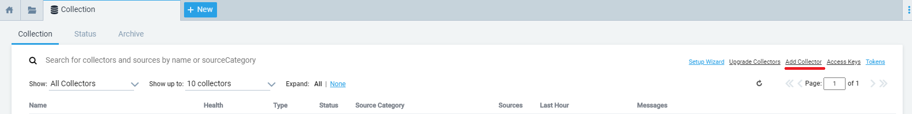
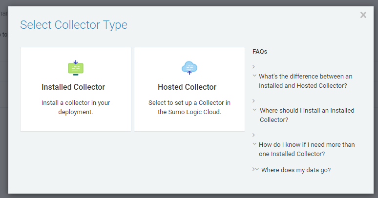
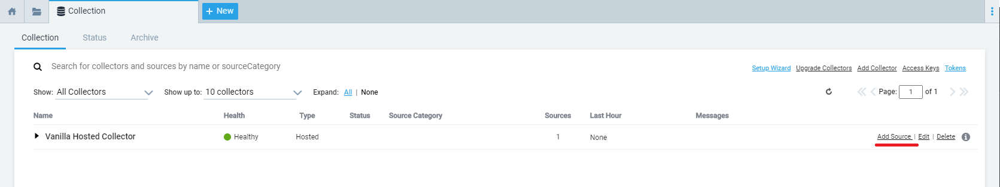
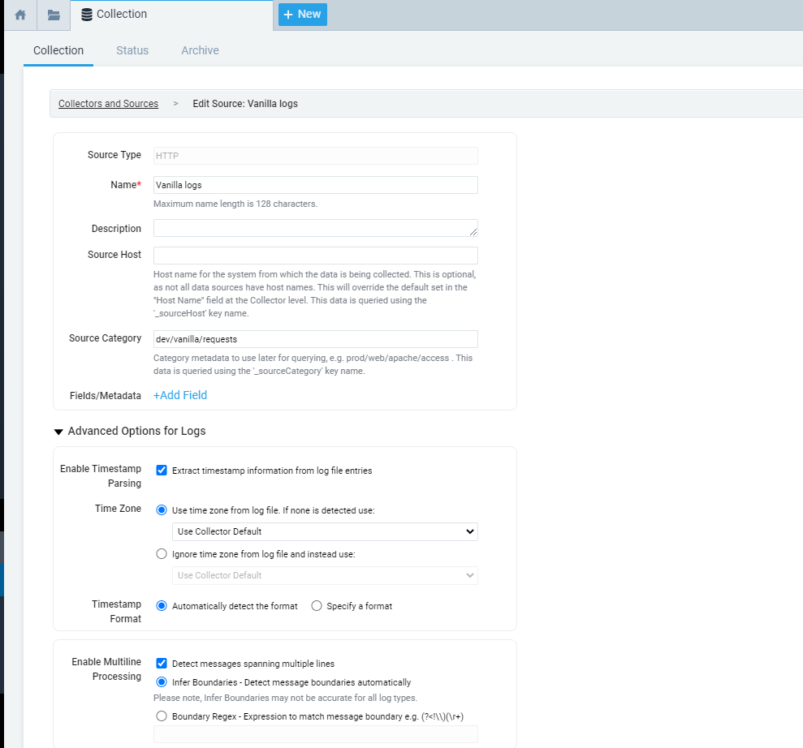
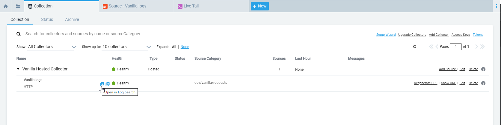
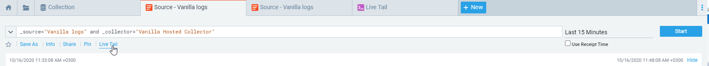
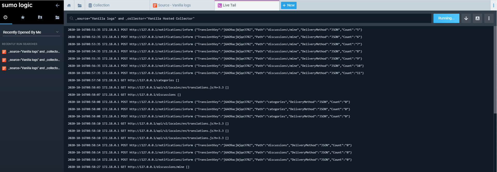

# Vanilla SumoLogic Plugin

## Prerequisites
- Sumo Logic account.
If you don't have a Sumo Logic account yet, you can easily create one by going to 
https://www.sumologic.com and clicking the Free Trial button--no cost, just enter your email.
- You must have an HTTP source in your Sumo Logic account

## How add an HTTP source in your Sumo Logic account
 - Go to 'Manage Data' in the left Panel and click on 'Collection'. The 'Collection' tab should be displayed. 
 
 - Click on the 'Add Collector' link:
 
 

- Choose 'Hosted Collector'. Set up the required fields and click on Save:
 
 

 - Click on the 'Add Source' link to add an Http Source in your collector: 

  
 
 - Set up the required fields and click on Save it:
 
  
  
  
  After configuring the Http Source,  a unique URL is generated. You'll use that URL to configure Vanilla Sumologic plugin.
  The URL securely encodes the SumoLogic Collector and Source information.
  
## Configure Vanilla Sumo Logic Plugin
To send Vanilla logs in Sumo Logic, the plugin must know which HTTP Source to use.
Enable the plugin and enter the Http Source URL in the 'Http Source URL' parameter.

## View Logs in Sumo Logic
The View log icon will be displayed if you hover the mouse over the line:

Log data is displayed with a slight delay. Processing data usually takes from several seconds to a few minutes to finish. 

You can see live trail:
 

Example of live tail output :

 